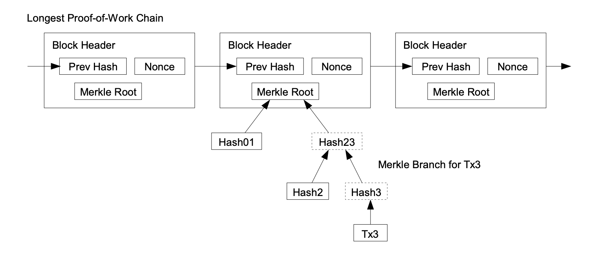
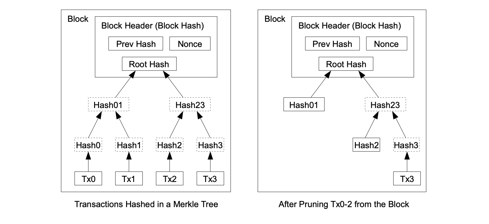

# Bitcoin Lite Network

TL;DR: *"Sync a Bitcoin node by downloading less than a Youtube video"*. We introduce a second-layer protocol for endusers to query Bitcoin's blockchain efficiently. Our construction works on top of today's bitcoin network and requires no consensus changes. 
In contrast to traditional light *clients* our protocol supports lite *nodes* which contribute resources to the network. 

## Output Paths 
An *output path* is a simple scheme to address every output ever happened in Bitcoin's blockchain:
```
output_path = block_index / transaction_index / output_index
```

### Output Paths and SPV proofs
Since the early days Bitcoin supported SPV inclusion proofs.

<p align="center">
  
</p>

Output paths correspond naturally to SPV proofs. This is easy to see: To verify an SPV proof one needs to know its block header within the best chain, 
this corresponds to a `block_index`. The Merkle path corresponds to a `transaction_index` and the transaction itself proves the `output_index`.

A SPV proof proves an output path's output.

### Output Path Encoding
We can encode an output path naively by padding zeros. This results in an integer of:

```
  log2( max_chain_height * max_transactions * max_outputs) bits 
= log2( 2*10^6 * 3000 * 3000 ) bits
~ 5.5 bytes 
~ 6 bytes
```

We encode output paths such that their natural order corresponds to their chronlogical order. Therefore, a path's most significant bits is its block index.

**Side note:** No block can have 3000 transactions with 3000 outputs. UTXO paths do not have 6 byte of entropy and thus compress well.

## UTXO paths
The *UTXO paths* is the set of all *unspent* outputs' paths. Currently, the set of all UTXO paths would be about 
```
70'000'000 UTXOs * 6 bytes = 420 MB
```
encoded naively. 


### Binary Search in the UTXO paths
A user wants to query all outputs of a particular Bitcoin address within the UTXO set. To do that efficiently, we can sort the set of all unspent output paths by the output's recipient addresses. 
This allows for binary search within the UTXO set. Each step requires downloading an SPV proof to compare the address at the current position. 
The size of a SPV proof is about:
```
= log2( #TX/block ) * hash_size + avg_TX_size
= log2(3000) * 32 bytes + 256 bytes
SPV_proof_size ~ 625 bytes
```

Therefore, a naive query requires total proof data of
```
  log2(#UTXOs) * SPV_proof_size 
= log2(70'000'000) * 625 bytes 
~ 16.3 kB 
```
per address.

**Side note** Addresses are distributed evenly and the set is sorted. So we can mostly guess a path's index to reduce the number of necessary SPV proofs per query.


### UTXO Commitments
A set of 420MB UTXO paths is still too large to sync quickly. We can split it into more handy chunks, of say 5 MB each, and merklize the set of all chunks.
To make updates more efficient, we sort the set by output age before chunking. 
This exploits the fact that old outputs are much more unlikely to get spent. The "oldest" chunk rarely gets touched at all. 

To support binary search, the output paths within each chunk are, again, sorted by the output's recipient address.
Querying outputs in recent blocks becomes cheaper and queries in old blocks are more expensive because they have to download also the older chunks.

Algorithm Summary 
- Sort the UTXO paths by time
- Chunk them into slices of ~ 5MB
- Within each chunks, sort all UTXO paths by address
- Hash the chunks and build a Merkle tree ( in chronological order )
- The Merkle root is the UTXO commitment 

This construction results in both efficient queries and efficient UTXO commitments.

**Side note:** Chunks have a start and end block height. This reduces the entropy of the paths further and allows for even better compression.


#### Chunking Strategy 
We need a deterministic chunking strategy. A naive solution is to chunk every 1000th block. The first blocks were much more sparse though, so the first chunks would be very small and the most recent chunks would be much bigger than 5MB.

Another naive solution is to chunk every 5 MB. That has highly dynamic boundaries though, and might require to rehash all chunks every block. That is too inefficient.

We need a balancing strategy for chunks such that they are balanced and efficiently updatable. 

A more objective measure would be to chunk i.e. every n-th transaction or every n-th output. That would be static boundaries that take into account the number of outputs. Nevertheless, it cannot model that old blocks contain much fewer *unspent* outputs.


### UTXO Commitment Updates
Suppose a lite node has synced only the longest PoW chain and the most recent UTXO commitment. To validate a next block it needs an SPV proof for every input spent in the block. Naively, for each block, that is an overhead of about:
```
  #TX/block * #outputs/TX * SPV_proof_size
= 3000 * 2 * 625 bytes / block
~ 3.75 MB / block
```
Suppose we have downloaded the SPV proofs for each UTXO consumed in the block. We denote such a set of SPV proofs as *block extension*. They prove output inclusion and imply the output paths. Then to prove an output was actually *unspent* we have to download the corresponding chunk of UTXO paths.

Assuming we have to download 2/3 of the chunks to prove all outputs of the 100 most recent blocks. Then we would have to download 280 MB of UTXO paths (uncompressed size).

Having the chunks of UTXO paths, the blocks and their inputs' SPV inclusion proofs, we can update the chunks. Thus, lite nodes can update the root UTXO commitment.
Updating old chunks only means deleting entries. Adding entries only ever happens in the newest chunk. The oldest chunk is rarely touched at all.


## Satoshi Pruning and Bridge Nodes 
In Satoshi's whitepaper the chapter "Reclaiming Disc Space" explains how to use the blocks' Merkle trees to prune the blockchain down to inclusion proofs for the UTXO set. Such *pruned blocks* are exacty what's needed to derive missing SPV proofs.
<p align="center">
  
</p>


Bridge nodes do not have to serve individual SPV proofs, but only the pruned blocks. This is only little computational overhead given the fact that old blocks are updated rarely. Also updates can happen lazily. In the worst case, a node just serves the raw block and let the recipient compute all demanded SPV proofs. A lite node can translate its queries to get served by any bitcoin node today. The degree of block pruning is irrelevant for security. The root of trust is the UTXO commitment -- not the existence of an SPV proof.

## The circle of proofs
The old, *pruned blocks* imply the *block extensions* to prove the new blocks.

The old, *pruned blockchain* implies the proofs for the new, *extended blockchain*.

## Lite Nodes 
Lite nodes mostly perform queries `output_path -> SPV_proof`. They might get as response an SPV proof, a pruned block or a raw block.
In any case, a node can reuse the full answer in its next query, or to answer other users' queries with SPV proofs to save bandwith. 

Lite nodes need to learn the UTXO commitment somehow. Ideally, there would be a consensus change to expect miners to include the current UTXO commitment in every block. Until then, we need a workaround. Lite nodes can check if all their peers believe in the same root hash. If there is a conflict, they could fall back to syncing the full chain since a trusted checkpoint. Verfying a chain of extended blocks requires no further trust.

A much more efficient algorithm to sync in case of two conflicting UTXO commitment conflict is as follows: 

- Download the Merkle leaves of both UTXO commitments. Suppose there are 500 chunks, that is `500*32 bytes = 16kBytes` of hashes.
- Compare the chunks' hashes and find the difference.
- Download the first chunks that are different. 
- Compare the chunks and find the first output path that differs. 
- Ask the other node for a *spending proof* for that output path. 
- Any malicous node has to abort this protocol quickly.
